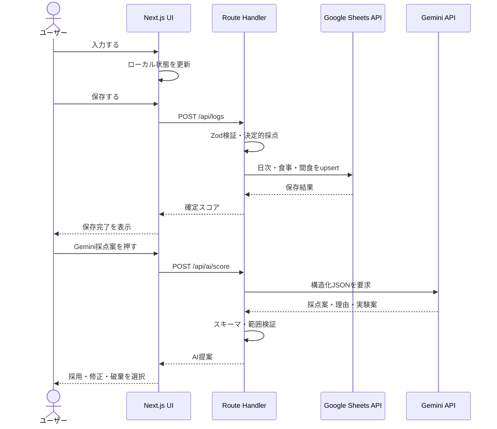

# powerUp API発火仕様書

## 1. 文書概要

| 項目 | 内容 |
|---|---|
| 対象 | powerUp MVP |
| API実装 | Next.js App Router Route Handler |
| 永続化 | Google Sheets API |
| AI | Google Gemini API |
| 目的 | どのUI操作で、どのAPIを、何回、どの条件で呼び出すかを固定する |
| ステータス | Draft v0.1 |

本書の「発火」は、ブラウザからNext.jsのAPI Routeへリクエストを送ることを指す。Google Sheets APIとGemini APIはブラウザから直接呼び出さず、Next.jsサーバー側からのみ実行する。

## 2. 基本原則

- 入力途中の状態はReactのローカル状態で保持し、APIを呼び出さない
- 明示的な保存操作でのみGoogle Sheetsへの書き込みを発火する
- Geminiはユーザーが「Gemini採点案」を押したときだけ発火する
- 同じ日付・同じ内容の保存で重複行を作らない
- GETは画面表示に必要な範囲だけ取得し、取得済みの日付は画面内で再利用する
- API失敗時に入力中のデータを破棄しない
- 未入力を0点として保存するためのAPI発火は行わない

## 3. API一覧

| API | メソッド | 主な用途 | 発火元 |
|---|---|---|---|
| `/api/health` | GET | デプロイ後の稼働確認 | 手動、監視、受け入れ確認 |
| `/api/logs` | GET | 直近7日間などの一覧取得 | 今日・ログ画面の初期表示 |
| `/api/logs/[date]` | GET | 選択日の詳細取得 | ログ画面の日付選択 |
| `/api/logs` | POST | 日次ログの保存・更新 | 明示的な保存ボタン |
| `/api/ai/score` | POST | Geminiの採点案・改善案取得 | Gemini採点案ボタン |

## 4. 発火タイミング一覧

### 4.1 ページ表示

| UIイベント | API | 発火条件 | 発火回数 |
|---|---|---|---:|
| 今日の画面を初めて表示 | `GET /api/logs` | 直近7日間の概要が未取得 | 1回 |
| ログ画面を初めて表示 | `GET /api/logs` | 日付一覧が未取得 | 1回 |
| ログ画面を開いて初期日を選択 | `GET /api/logs/[date]` | 選択日の詳細がキャッシュにない | 1回 |
| 同じ画面へ再描画 | なし | 既に同じ条件のデータがある | 0回 |

初期表示では、一覧APIのレスポンスに今日の概要が含まれる場合はそれを再利用し、同じ情報を取り直さない。

### 4.2 日付選択

| UIイベント | API | 発火条件 | 発火回数 |
|---|---|---|---:|
| 直近7日の別日付を選択 | `GET /api/logs/[date]` | 選択日が現在表示中の日付と異なる | 最大1回 |
| 一度取得した日付を再選択 | なし | `dailyLogCache[date]`が存在する | 0回 |
| 同じ日付を再クリック | なし | 日付が変わっていない | 0回 |
| 日付一覧の並び替え | なし | MVPでは日付順固定 | 0回 |

### 4.3 日次ログ保存

| UIイベント | API | 発火条件 | 発火回数 |
|---|---|---|---:|
| 「保存する」を押す | `POST /api/logs` | 必須項目の入力検証に成功 | 1回 |
| 入力エラーのまま保存する | なし | クライアント検証でエラー | 0回 |
| 保存中に再度押す | なし | `isSaving = true` | 0回 |
| 通信失敗後に「再試行」 | `POST /api/logs` | 同じ`clientRequestId`を使用 | 1回 |
| 入力欄へ文字を入力 | なし | 入力中 | 0回 |
| チェックボックスを変更 | なし | 入力中 | 0回 |

保存APIは、日次情報・朝食・昼食・夕食・間食を1つのリクエストで受け付ける。サーバー側で決定的なスコアを計算し、Google Spreadsheetへupsertする。

### 4.4 Gemini採点案

| UIイベント | API | 発火条件 | 発火回数 |
|---|---|---|---:|
| 「Gemini採点案」を押す | `POST /api/ai/score` | 成果コメントまたは分析対象データが存在 | 1回 |
| 同じ内容でもう一度押す | `POST /api/ai/score` | ユーザーが明示的に再実行 | 1回 |
| 入力中に自動提案 | なし | MVPでは実施しない | 0回 |
| チェックボックスを変更 | なし | AIボタンを押していない | 0回 |
| Gemini提案を採用 | `POST /api/logs` | 確定した点数・提案を保存する場合 | 1回 |
| Gemini提案を破棄 | なし | ユーザーが使わない場合 | 0回 |

Geminiは、総合スコアそのものを計算しない。アプリの採点ロジックで計算したカテゴリ点と、成果コメントから提案を生成する。Geminiが利用できない場合も、通常の保存とプログラム採点は継続する。

### 4.5 ヘルスチェック

`GET /api/health`は、画面操作から自動発火させない。以下の用途に限定する。

- Vercelデプロイ後の手動確認
- CIまたは外部監視からの稼働確認
- Google Sheetsの認証設定を含めたサーバー設定確認

ヘルスチェックのレスポンスにAPIキー、Spreadsheet ID、サービスアカウント情報を含めない。

## 5. リクエスト・レスポンス仕様

### 5.1 `GET /api/logs`

```text
GET /api/logs?from=2026-07-23&to=2026-07-29
```

#### レスポンス

```json
{
  "logs": [
    {
      "date": "2026-07-29",
      "totalScore": 82,
      "recordingRate": 100,
      "scores": { "sleep": 41, "food": 26, "phone": 7, "result": 8 },
      "status": "confirmed"
    }
  ],
  "range": { "from": "2026-07-23", "to": "2026-07-29" }
}
```

### 5.2 `GET /api/logs/[date]`

`date`は`YYYY-MM-DD`形式のみ受け付ける。

#### レスポンス

```json
{
  "date": "2026-07-29",
  "status": "confirmed",
  "scores": { "sleep": 41, "food": 26, "phone": 7, "result": 8, "total": 82 },
  "sleep": { "pixelWatchScore": 82, "recoveryFeeling": 4 },
  "meals": [],
  "snacks": [],
  "result": {
    "achievementText": "企画書の構成を完成させた。",
    "focusMinutes": 75,
    "reflectionRating": 4,
    "comment": "午後は集中しやすかった。"
  },
  "aiInsight": {
    "reason": "企画書の構成を完成させているためです。",
    "nextExperiment": "昼食後に10分歩いて眠気を比べます。"
  },
  "timeline": []
}
```

### 5.3 `POST /api/logs`

#### リクエスト

```json
{
  "clientRequestId": "20260729-210000-abc123",
  "date": "2026-07-29",
  "sleep": { "pixelWatchScore": 82, "recoveryFeeling": 4 },
  "meals": [],
  "snacks": [],
  "phone": {
    "entertainmentMinutes": 102,
    "separatedDuringWork": true,
    "limitedMorningOrNightUse": true
  },
  "result": {
    "achievementText": "企画書の構成を完成させた。",
    "focusMinutes": 75,
    "reflectionRating": 4,
    "comment": "午後は集中しやすかった。"
  },
  "confirmedAchievementScore": 4,
  "scoreVersion": "v1"
}
```

#### レスポンス

```json
{
  "saved": true,
  "clientRequestId": "20260729-210000-abc123",
  "log": {
    "date": "2026-07-29",
    "totalScore": 82,
    "recordingRate": 100,
    "scores": { "sleep": 41, "food": 26, "phone": 7, "result": 8 }
  }
}
```

### 5.4 `POST /api/ai/score`

#### リクエスト

```json
{
  "date": "2026-07-29",
  "achievementText": "企画書の構成を完成させ、レビュー依頼を送った。",
  "reflectionRating": 4,
  "focusMinutes": 75,
  "foodSummary": { "lunch": "甘い飲料あり、食後歩行なし" },
  "deterministicScores": { "sleep": 41, "food": 26, "phone": 7 }
}
```

#### レスポンス

```json
{
  "proposal": {
    "achievementScore": 4,
    "confidence": "medium",
    "reason": "具体的な成果物の完成とレビュー依頼まで進めているためです。",
    "nextExperiment": "次回は昼食後に10分歩き、午後の眠気を比べてみましょう。"
  },
  "provider": "gemini",
  "model": "configured-model",
  "requestId": "ai-20260729-abc123"
}
```

## 6. シーケンス



## 7. 再試行・重複・レート制限

### 7.1 GET

- ネットワークエラー時のみ、クライアントが最大1回再試行する
- 同じURL・同じ日付のリクエストを同時に複数発火させない
- 画面内キャッシュを使い、同じ日付の再選択では発火しない

### 7.2 POST `/api/logs`

- `clientRequestId`を必須とし、再試行時も同じ値を使う
- サーバーは日付とIDを確認して冪等に処理する
- 保存中ボタンをdisabledにする
- 自動リトライは最大1回。失敗した場合はユーザー操作へ戻す

### 7.3 POST `/api/ai/score`

- AIボタン連打をクライアントとサーバーの両方で抑制する
- 429の場合は自動再試行せず、ユーザーに再実行を案内する
- 再実行は費用・無料枠を消費する可能性があるため、必ず明示操作とする
- 同じ結果を採用するまでは`ai_insights`へ確定値として保存しない

## 8. 発火させない操作

- テキスト入力の1文字ごとの変更
- 食事チェックリストの選択変更
- 間食フォームの追加・削除操作中
- 入力カードの開閉
- グラフのホバー、スクロール、タブ移動
- 同じ日付の再選択
- AI提案の表示だけを行う操作

## 9. 画面側の共通状態

APIごとに以下の状態を持つ。

```text
idle      初期状態
loading   発火中。ボタンと同一操作を抑制
success   成功。データと最終取得時刻を更新
error     失敗。入力を保持して再試行を提示
```

表示文言は、API名や内部エラーではなくユーザーの次の行動で示す。

| 状態 | 表示例 |
|---|---|
| 保存中 | 保存しています… |
| 保存成功 | 保存しました |
| Sheetsエラー | 保存できませんでした。入力は保持されています。 |
| Gemini発火中 | Geminiが採点案を作成しています… |
| Gemini制限 | AIの利用上限に達した可能性があります。通常の採点は利用できます。 |

## 10. 受け入れ条件

- 文字入力中にAPIが発火しない
- チェック変更だけでGemini APIが発火しない
- 保存ボタン1回で`POST /api/logs`が最大1回発火する
- 保存失敗後の再試行で重複行が作られない
- 日付を変えたときだけ詳細取得APIが発火する
- Geminiは明示ボタンでのみ発火する
- Gemini失敗時も、決定的な採点とGoogle Spreadsheet保存が利用できる
- APIキーとGoogle認証情報がブラウザへ送られない
- Vercelの環境変数を設定後、ヘルスチェックとPreview保存を実行できる

## 11. 参照資料

- [Next.js App Router](https://nextjs.org/docs/app)
- [Google Sheets APIの公式チュートリアル](https://codelabs.developers.google.com/codelabs/sheets-api)
- [Gemini APIの構造化出力](https://ai.google.dev/gemini-api/docs/structured-output)
- [Vercelの環境変数](https://vercel.com/docs/environment-variables)
