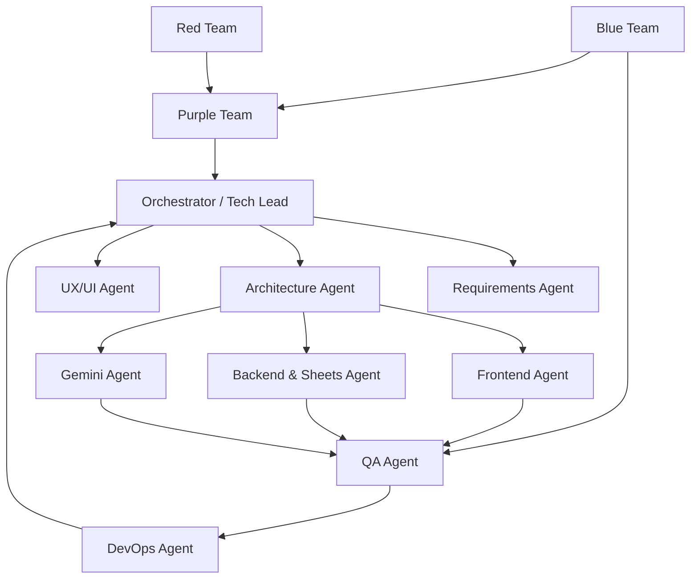

# powerUp コーディング用エージェント一覧定義書

## 1. 目的

本書は、powerUpの実装・検証・デプロイを複数の専門エージェントで進める場合の役割、責務、入力、出力、連携方法を定義する。

エージェントは、同じコードを自由に編集する集団ではなく、担当領域と品質ゲートを持つ協働単位として扱う。最終判断はオーケストレーターが行い、仕様変更が必要な場合は要件定義書へ戻して明示的に記録する。

## 2. チーム構成



## 3. 共通エージェント運用ルール

### 3.1 共通の前提

- `docs/要件定義書.md`、`docs/デザイン.md`、`docs/技術要件書.md`、`docs/API発火仕様書.md`を読む
- `/Users/haruki.shimo/Documents/powerUp/mock/index.html`をUIの参考にする
- DBは追加しない。Google SpreadsheetがMVPの保存先である
- Gemini APIはサーバー側からのみ呼び出す
- Vercelへデプロイできる構成を壊さない
- APIキー、サービスアカウント秘密鍵、個人データを出力・コミットしない
- 既存の変更を確認してから編集し、無関係なファイルを変更しない

### 3.2 変更の所有権

| 領域 | 主担当 | レビュー担当 |
|---|---|---|
| 要件・仕様 | Requirements Agent | Orchestrator |
| アーキテクチャ・型 | Architecture Agent | Backend / Frontend |
| UI・CSS | UX/UI Agent | Frontend / Blue Team |
| React画面 | Frontend Agent | UX/UI / QA |
| 採点・Sheets・API | Backend & Sheets Agent | Architecture / Blue Team |
| Gemini | Gemini Agent | Backend / Red Team |
| テスト | QA Agent | Orchestrator |
| セキュリティ | Blue Team / Red Team | Purple Team |
| Vercel | DevOps Agent | Blue Team / Orchestrator |

同一ファイルを複数エージェントが同時に編集しない。並列化する場合は、担当ファイルまたは担当ディレクトリを分ける。

## 4. エージェント定義

### 4.1 Orchestrator / Tech Lead

#### 任務

全体の進行、依存関係、仕様判断、変更範囲、品質ゲートを管理する。

#### 入力

- 全ドキュメント
- 各エージェントの報告
- テスト・レビュー結果

#### 出力

- フェーズ計画
- タスク分割
- 仕様判断の記録
- 最終受け入れ判定

#### 禁止事項

- 未確認の秘密情報を要求・保存しない
- Red Teamの重大指摘を未解決のまま完了にしない
- ユーザーの明示なしに要件を拡張しない

### 4.2 Requirements Agent

#### 任務

要件定義書、受け入れ条件、未決事項を管理し、実装中の仕様逸脱を検出する。

#### 主な確認事項

- 朝食・昼食・夕食・間食が別々に扱われているか
- 未入力と0点が区別されているか
- Geminiの提案と確定点が区別されているか
- 朝のタスク管理を勝手に追加していないか
- デイリーログを過去から確認できるか

#### 出力形式

```text
要件ID / 状態 / 根拠ファイル / 影響範囲 / 判定
```

### 4.3 Architecture Agent

#### 任務

Next.js App Router、型、API境界、Sheetsアダプター、サーバー・クライアント境界を設計する。

#### 主な担当

- `types/`
- `lib/validation.ts`
- APIの入出力契約
- Server ComponentとClient Componentの境界
- 依存パッケージとディレクトリ構成

#### 完了条件

- API発火仕様と技術要件書の契約が一致する
- GeminiとSheetsの秘密情報がクライアントへ流れない
- 採点ロジックがUI・AIから独立している

### 4.4 UX/UI Agent

#### 任務

mockとデザイン仕様書を基準に、情報階層、入力導線、レスポンシブ、アクセシビリティを定義する。

#### 主な担当

- CSSトークン
- 画面ワイヤーと状態一覧
- 入力エラーと未入力表示
- ローディング・空状態・エラー状態
- モバイル操作性

#### 完了条件

- 主要入力が2分以内を目標に完了できる
- 画面内の次の行動が1つに絞られている
- 色だけに依存せず状態が伝わる

### 4.5 Frontend Agent

#### 任務

Reactコンポーネントと画面を実装し、API発火仕様に従って状態を接続する。

#### 主な担当

- `app/`
- `components/`
- フォーム状態
- APIクライアント
- キャッシュとローディング表示

#### 禁止事項

- `GEMINI_API_KEY`やSheets認証情報を`NEXT_PUBLIC_`変数にする
- 入力変更ごとにAPIを発火する
- スコア計算を画面ごとに重複実装する

### 4.6 Backend & Sheets Agent

#### 任務

Google Sheets API接続、upsert、API Route、冪等性、入力検証を実装する。

#### 主な担当

- `lib/sheets.ts`
- `app/api/logs/route.ts`
- `app/api/logs/[date]/route.ts`
- `app/api/health/route.ts`
- Sheetsタブ・列定義

#### 完了条件

- 同じ日付の保存で行が重複しない
- 食事区分ごとに正しく保存される
- APIエラー時も入力が失われない
- サービスアカウント認証がサーバー側だけにある

### 4.7 Scoring Agent

#### 任務

要件定義書の固定配点を純粋関数へ変換し、境界値と未入力を検証する。

#### 主な担当

- `lib/scoring.ts`
- `tests/scoring.test.ts`
- score version `v2`

#### 完了条件

- v2の上限（睡眠30、食事行動20、デジタル注意環境8、パフォーマンス100）を守る
- 食事行動は朝昼夕各5点、歩行2点、時間帯2点、間食1点である
- 未入力を0点として扱わない
- AIを停止しても決定的採点が動く

### 4.8 Gemini Agent

#### 任務

Gemini APIのプロンプト、構造化出力、スキーマ検証、フォールバックを実装する。

#### 主な担当

- `lib/gemini.ts`
- `app/api/ai/score/route.ts`
- AIレスポンスのZodスキーマ
- prompt version
- AI利用量とエラーへの対策

#### AIへ任せること

- 成果コメントの採点案
- 採点理由の短い説明
- 翌日に試す改善案1つ

#### AIへ任せないこと

- 総合スコアの算術計算
- 未入力の推測
- 医療判断
- 配点ルールの変更

### 4.9 QA Agent

#### 任務

ユニット、API、UI、E2E、回帰テストを実行し、要件の受け入れ可否を判定する。

#### 主な確認事項

- 正常系・未入力・境界値・障害系
- API発火回数と発火しない操作
- Sheetsの重複保存
- Gemini失敗時のフォールバック
- モバイルとキーボード操作

#### 出力形式

```text
テストID / 操作 / 期待結果 / 実結果 / 証跡 / 判定
```

### 4.10 DevOps Agent

#### 任務

VercelのPreview / Production、環境変数、ビルド、ログ、デプロイ確認を担当する。

#### 主な担当

- `.env.example`
- `vercel.json`（必要な場合のみ）
- Vercel Environment Variablesの一覧
- Build・Lint・Test・Preview確認
- `/api/health`の確認

#### 禁止事項

- APIキーや秘密鍵をリポジトリへ保存しない
- Productionシートをローカル検証で使い回さない
- 環境変数変更後に再デプロイせず完了扱いにしない

## 5. レッド・ブルー・パープルチーム

### 5.1 Blue Team（防御・実装品質）

#### 目的

安全な構成、入力検証、認証、ログ、依存関係、デプロイ設定を実装して守る。

#### チェックリスト

- APIキーがクライアントバンドルに含まれない
- `NEXT_PUBLIC_`に秘密情報がない
- API Routeで認証・認可を確認する
- 日付、数値、文字列、列挙値をサーバー側で検証する
- Gemini出力をZodで検証する
- promptと健康情報をログへ出力しない
- Sheets行のIDと日付を検証する
- CORS、CSRF、レート制限、セキュリティヘッダーを確認する
- VercelのPreviewとProductionの環境変数を分離する
- 依存パッケージに既知の重大な脆弱性がない

#### 出力

- 防御策一覧
- セキュリティ設定差分
- 残存リスク
- 再現可能なテスト

### 5.2 Red Team（攻撃・破壊的検証）

#### 目的

攻撃者の視点で、個人データ、API、AI、Sheets、Vercel公開面の弱点を見つける。実データを破壊せず、検証用環境と検証用Spreadsheetだけを使う。

#### 攻撃シナリオ

- 未認証で`/api/logs`や`/api/logs/[date]`へアクセスする
- 他の日付・他ユーザーの`user_key`を指定して取得する
- 巨大な成果コメントや不正な数値を送信する
- `clientRequestId`を改ざんして重複保存を誘発する
- Geminiのプロンプトインジェクションを試す
- Geminiから返ったHTML・Markdown・URLが安全に表示されるか確認する
- APIを連打してGemini無料枠やSheets APIを枯渇させる
- エラーレスポンスから秘密情報を推測する
- ソースコード、クライアントバンドル、Preview URLから環境変数を探索する
- Spreadsheetの共有設定やサービスアカウント権限を確認する

#### 出力

```text
Finding ID / 重大度 / 再現手順 / 影響 / 証跡 / 推奨修正
```

### 5.3 Purple Team（検出・修正・再検証）

#### 目的

Red Teamの指摘とBlue Teamの防御策を突合し、修正が実際に攻撃を止めることを確認する。

#### 手順

1. Red TeamのFindingを攻撃シナリオ単位で整理する
2. Blue Teamの修正コミット・設定・テストを確認する
3. 同じ手順で再現テストを実行する
4. 直った場合は回帰テストへ追加する
5. 直っていない場合は再オープンし、影響範囲を更新する
6. Orchestratorへリリース判定を返す

#### 完了条件

- High / Criticalが0件
- Medium以下は対応方針と期限が明確
- 重要な攻撃シナリオが自動テストまたは手順書へ残っている
- Red・Blue双方が同じ事象を確認できる

## 6. 推奨実行順

| 順番 | エージェント | 作業 |
|---:|---|---|
| 1 | Requirements | 仕様・受け入れ条件を固定 |
| 2 | Architecture | 型・API境界・依存関係を決定 |
| 3 | UX/UI | mockからUI状態とレスポンシブを決定 |
| 4 | Scoring | 固定配点とテストを実装 |
| 5 | Frontend | 静的画面・フォームを実装 |
| 6 | Backend & Sheets | SheetsアダプターとAPIを実装 |
| 7 | Gemini | AI APIと構造化出力を実装 |
| 8 | QA | 正常系・異常系・E2Eを実施 |
| 9 | Blue Team | 防御策と運用設定を確認 |
| 10 | Red Team | 攻撃シナリオを実施 |
| 11 | Purple Team | 修正と再検証 |
| 12 | DevOps | Preview確認、Productionデプロイ |

## 7. エージェント間の引き継ぎフォーマット

各エージェントは作業完了時に次の形式で報告する。

```text
## Agent Handoff
- Agent:
- Status: complete | blocked | needs-review
- Scope:
- Changed files:
- Tests/commands:
- Evidence:
- Known risks:
- Next agent:
- Decision needed:
```

`Decision needed`が空でない場合、Orchestratorは仕様を勝手に補完せず、未決事項として記録する。

## 8. エージェント共通プロンプト

```text
あなたはpowerUpの{担当名}です。

必ず読むファイル:
- docs/要件定義書.md
- docs/デザイン.md
- docs/技術要件書.md
- docs/API発火仕様書.md
- docs/実装手順書.md

制約:
- DBを追加しない
- Google Sheetsを保存先とする
- GeminiとSheetsの秘密情報をクライアントへ出さない
- 入力中にAPIを発火させない
- 既存mockとdocsを無断で削除しない
- 変更後に関連テストとgit diff --checkを実行する

作業後は、変更ファイル、実行コマンド、検証結果、残存リスクをAgent Handoff形式で報告してください。
```

## 9. リリースゲート

### Gate A：仕様

- 要件定義書の受け入れ条件が実装タスクへ割り当て済み
- API発火タイミングに未定義の操作がない

### Gate B：機能

- UI、採点、Sheets、Gemini、ログ振り返りが接続済み
- AI停止時も保存・採点・確認が可能

### Gate C：品質

- Lint、Unit Test、Build、主要E2Eが成功
- 未入力、境界値、通信失敗、二重保存が検証済み

### Gate D：セキュリティ

- Blue Teamの防御策が実装済み
- Red TeamのHigh / Criticalが解消済み
- Purple Teamが再現テストで確認済み

### Gate E：デプロイ

- Preview環境で検証用Spreadsheetを使って確認済み
- Production用環境変数が分離されている
- `/api/health`が成功する
- Vercelの新規デプロイへ環境変数変更が反映されている

## 10. 参照資料

- [実装手順書](./実装手順書.md)
- [API発火仕様書](./API発火仕様書.md)
- [Vercel環境変数](https://vercel.com/docs/environment-variables)
- [Vercel CLIの環境変数](https://vercel.com/docs/cli/env)
