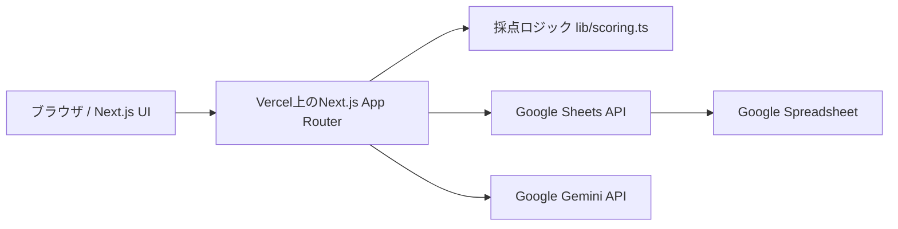

# powerUp 技術要件書

## 1. 文書概要

| 項目 | 内容 |
|---|---|
| プロダクト | powerUp（仮） |
| 対象 | MVP |
| フロントエンド | Next.js / React / TypeScript |
| AI | Google Gemini API |
| データ保存 | Google Spreadsheet（Google Sheets API） |
| データベース | 使用しない |
| デプロイ | Vercel |
| ステータス | Draft v0.1 |

本書は、[`docs/要件定義書.md`](./要件定義書.md)で定義した機能を実装するための技術的な構成、データ形式、API、セキュリティ、運用要件を定義する。

## 2. 技術方針

### 2.1 採用方針

- Next.jsのApp Routerを使用する
- UIはReactコンポーネントで構築する
- TypeScriptをstrict設定で使用する
- 日次スコアの計算は、再現性のあるTypeScriptの純粋関数で行う
- Google SpreadsheetをMVPのSystem of Recordとし、専用データベースは作らない
- Gemini APIはNext.jsのサーバー側Route Handlerから呼び出す
- VercelのPreview / Production環境を利用する
- AIが返すJSONはスキーマ検証後に画面へ渡す

### 2.2 MVPの利用前提

MVPは、まず個人利用または少人数の非公開利用を対象とする。アプリの利用者とGoogle Spreadsheetの所有者が同一である構成を基本とし、ユーザーごとの厳密なデータ分離は一般公開前の追加要件とする。

一般公開する場合は、Vercelのアクセス制御またはアプリ内認証を必須とする。認証なしで個人の睡眠・食事データを公開URLへ保存してはならない。

## 3. システム構成



### 3.1 責務分担

| 領域 | 担当 | ルール |
|---|---|---|
| 画面表示・入力 | Next.js / React | 入力中の状態とエラーを即時表示する |
| ルーティング | Next.js App Router | `/`, `/logs`, `/analysis`, `/settings`を基本とする |
| 採点 | `lib/scoring.ts` | 同じ入力に対して同じ結果を返す。AIに計算を委ねない |
| 永続化 | Google Sheets API | サーバー側からのみ読み書きする |
| 自然文の分類・提案 | Gemini API | 採点案、理由、翌日の実験案を構造化JSONで返す |
| デプロイ | Vercel | Git連携と環境変数でPreview / Productionを管理する |

### 3.2 キャッシュ方針

- 日次ログの取得は最新データを優先し、更新後に古い値を表示しない
- POST / PATCH相当の保存後は、画面側で該当ログを再取得する
- Geminiの結果は毎回のチェック変更では取得しない
- AI提案はユーザーがボタンを押したときだけ実行し、必要に応じて`request_id`単位で保存する

## 4. Next.jsアプリ要件

### 4.1 基本設定

- Next.jsのApp Routerを採用する
- TypeScriptの`strict: true`を有効にする
- UIの状態変更が必要なコンポーネントに限定して`use client`を付与する
- Google Sheets APIとGemini APIを呼び出すモジュールはサーバー専用にする
- 秘密情報を含むモジュールをClient Componentからimportしない
- 日付・時刻は保存時にISO 8601形式へ正規化する
- 表示時のタイムゾーンは`Asia/Tokyo`を初期値とする
- 作成・更新日時と保存タイムラインは`Asia/Tokyo`（`+09:00`）で生成し、旧実装のUTCタイムラインは読み込み時に日本時間へ移行する

### 4.2 推奨ディレクトリ

```text
app/
  layout.tsx
  page.tsx
  logs/page.tsx
  analysis/page.tsx
  settings/page.tsx
  api/
    logs/route.ts
    logs/[date]/route.ts
    ai/score/route.ts
components/
  app-shell.tsx
  score-hero.tsx
  metric-card.tsx
  trend-summary.tsx
  sleep-editor.tsx
  meal-editor.tsx
  snack-editor.tsx
  phone-editor.tsx
  result-editor.tsx
  gemini-insight-card.tsx
  daily-log-list.tsx
  daily-log-detail.tsx
lib/
  scoring.ts
  sheets.ts
  gemini.ts
  validation.ts
  dates.ts
types/
  domain.ts
  api.ts
tests/
  scoring.test.ts
```

### 4.3 主要パッケージ

実装開始時の安定版を採用し、lockfileで固定する。

| パッケージ | 用途 |
|---|---|
| `next` | Webアプリ、App Router、Route Handler |
| `react`, `react-dom` | UI |
| `typescript` | 型安全性 |
| `zod` | 入力とGemini出力のスキーマ検証 |
| `@google/genai` | Gemini APIクライアント |
| `googleapis` | Google Sheets APIクライアント |
| `date-fns` | 日付の範囲計算・表示補助（必要な場合） |
| `vitest` | 採点ロジックのユニットテスト |
| `playwright` | 主要画面のE2Eテスト（MVP後半） |

## 5. 画面・ルート要件

| ルート | 実装 | 内容 | MVP |
|---|---|---|---|
| `/` | Server + Client Components | 今日のダッシュボードと日次入力 | 必須 |
| `/logs` | Server + Client Components | 直近7日間のログ振り返り | 必須 |
| `/analysis` | Server + Client Components | 7日・30日の傾向分析 | 任意。最小グラフは`/`に含める |
| `/settings` | Client Component中心 | スコア設定、表示設定 | 任意 |

### 5.1 保存単位

保存単位は「ユーザー × 日付」とする。食事は日付内の`breakfast`、`lunch`、`dinner`に分け、間食は1日複数件を許容する。

### 5.2 未入力の扱い

- `null`または未保存は未入力として扱う
- 未入力を自動的に0点へ変換しない
- 画面では「未記録」「暫定」と表示する
- 全項目が入力されていない日でも、入力済み部分の点数と記録率を表示できる
- 実績の完成・未完成にかかわらず、実績と分離した現在時点の推定パフォーマンスを表示する
- 推定値には「推定」、評価時刻、入力カバー率、6要素の内訳を併記し、実績の時系列平均へ含めない

### 5.3 採点系統

利用者向けの採点系統は5種類（実際のパフォーマンス、睡眠、食事、デジタル注意環境、推定パフォーマンス）とする。`lib/scoring.ts`には、内訳を含め13個の公開計算関数を置く。

実績は成果55・集中30・品質15で計100点とする。現在推定は睡眠準備度30・起床後時間10・現在の覚醒感15・作業／予定10・直近の食事20・デジタル注意環境15で計100点とする。欠測は中立値50へ縮約し、入力済み条件だけで100点へ再配分しない。睡眠スコア75超・覚醒感3超・起床後1〜6時間の条件が揃う場合に限り、睡眠と覚醒感の既存配点枠内で最大3点の実験的な相乗加点を行う。推定モデル版`current-condition-v3`を保存する。詳細式は[`docs/採点ロジックレビュー.md`](./採点ロジックレビュー.md)を正とする。

## 6. データモデルとGoogle Spreadsheet

### 6.1 スプレッドシート構成

1つのスプレッドシートに、以下のタブを作成する。1行目はヘッダーとして固定する。

| タブ | 用途 | 主キー相当 |
|---|---|---|
| `daily_logs` | 1日の基本情報、カテゴリ点、確定スコア | `user_key + log_date` |
| `meal_logs` | 朝食・昼食・夕食の詳細 | `user_key + log_date + meal_type` |
| `snack_logs` | 間食の明細 | `snack_id` |
| `ai_insights` | Geminiの提案とユーザー確認状態 | `request_id` |

### 6.2 `daily_logs`列

```text
log_id
user_key
log_date
sleep_score
recovery_feeling
food_score
phone_score
result_score
total_score
recording_rate
focus_minutes
achievement_text
achievement_ai_score
achievement_confirmed_score
reflection_rating
user_comment
ai_suggestion
score_version
payload_json
created_at
updated_at
meal_timing_regular
dinner_before_bed
no_long_gap
entertainment_minutes
separated_during_work
limited_morning_or_night_use
achievement_points
focus_points
quality_points
estimated_performance_score
estimate_coverage
estimate_version
assessment_time
next_commitment_time
wake_time
current_alertness
continuous_work_minutes
minutes_until_next_commitment
estimate_components_json
estimate_reasons_json
```

`payload_json`は、画面の詳細表示に必要な日次記録・タイムライン・確定状態をJSON文字列として保持する実装補助列である。各スコア列は一覧表示と確認用に個別でも保持し、JSONだけに依存しない。

採点v2で分析に使う食事タイミング、デジタル注意環境、パフォーマンス3要素、および現在推定の値・カバー率・モデル版・評価文脈・内訳は、既存列の位置を変えず末尾へ追加する。推定値は監査・将来の本人データによる補正用であり、`result_score`や`total_score`へ転記しない。ユーザーは`next_commitment_time`（次の予定の時刻）を入力し、アプリは`assessment_time`との差分を`minutes_until_next_commitment`へ算出して採点・保存する。時刻が評価時刻より前の場合は翌日の予定として扱う。旧payloadに評価文脈がなければ`null`として扱う。PreviewやProductionの接続先が旧列構成の場合は、保存アダプターが不足列と必要な列数を末尾へ自動追加する。

### 6.3 `meal_logs`列

```text
meal_id
user_key
log_date
meal_type
eaten_at
carbohydrate_level
protein_level
vegetable_level
portion_level
drink_type
feature_flags
walk_minutes
post_meal_sleepiness
meal_score
score_source
updated_at
```

`feature_flags`には、`noodle`、`fried`、`eating_out`、`double_staple`などの値をJSON文字列またはカンマ区切りで保存する。実装ではJSON文字列を推奨する。

### 6.4 `snack_logs`列

```text
snack_id
user_key
log_date
eaten_at
occurred
category
amount_level
planned
before_bed
snack_score
note
created_at
updated_at
```

間食なしは明細行を作らず、日次ログまたはUI状態で「なし」を保持する。間食ありの場合は複数行を保存し、日次の間食点は平均を計算して1点を上限とする。`before_bed`は量とは分けて`true`、`false`、空欄のいずれかで保存する。

### 6.5 `ai_insights`列

```text
request_id
user_key
log_date
provider
model
prompt_version
input_hash
achievement_score
confidence
reason
next_experiment
raw_response_saved
confirmed
created_at
```

健康・生活データを含むため、Geminiの生レスポンスを保存するかは運用方針で決定する。初期値は`raw_response_saved = false`とし、画面表示に必要な最小項目だけ保存する。

### 6.6 Sheets APIの保存ルール

- Google Sheets APIはサーバー側からのみ使用する
- `user_key + log_date`を検索して既存日次行を更新し、なければ追加する
- 食事は`meal_type`を含むキーで更新する
- 間食は一意な`snack_id`で追加・更新する
- ヘッダー行を毎回上書きしない
- 保存前にZodで入力を検証する
- APIエラー時は再試行しても二重保存されないよう、`log_id`や`meal_id`をクライアントから引き継ぐ
- シートの列順をコード上の定数として管理する

## 7. 採点ロジック

専門レビュー、根拠、解釈上の制約は[`採点ロジックレビュー.md`](./採点ロジックレビュー.md)を参照する。実装上の配点定数は`lib/scoring.ts`をソース・オブ・トゥルースとする。

### 7.1 パフォーマンススコア

```text
performanceScore = confirmedAchievement(0〜55)
                 + focusWork(0〜30)
                 + qualityAndEfficiency(0〜15)
```

睡眠・食事・デジタル注意環境は、パフォーマンスへ影響し得る条件として独立表示し、パフォーマンススコアへ加算しない。これにより、条件指標と結果指標の循環・二重評価を避ける。

```text
確定成果 = round(confirmedAchievementScore / 5 × 55)
集中作業 = round(min(focusMinutes, 90) / 90 × 30)
品質・効率 = round((reflectionRating - 1) / 4 × 15)
成果入力カバー率 = 入力済み項目の配点合計 / 100 × 100
```

未入力は0や平均値へ変換せず、部分入力を100点へ再正規化しない。成果点5/5のみ入力した場合は55/100、カバー率55%の暫定値とする。

### 7.2 睡眠コンディション

```text
subjectiveIndex = recoveryFeelingあり
  ? (recoveryFeeling - 1) × 25
  : pixelWatchSleepScore

combinedSleepIndex = pixelWatchSleepScore × 0.85 + subjectiveIndex × 0.15
sleepCondition = clamp(round(combinedSleepIndex × 0.30), 0, 30)
```

`pixelWatchSleepScore`が未入力なら`null`とする。回復感だけで睡眠点を作らない。ウェアラブル値は診断や治療判断に使用しない。

### 7.3 食事行動

食事行動は20点の独立指標とし、パフォーマンス点へ加算しない。

```text
foodBehavior = mealComposition(0〜15)
             + postMealWalk(0〜2)
             + timing(0〜2)
             + snack(0〜1)
```

各食事の構成は5点とする。

| 判定 | 点 |
|---|---:|
| 野菜が十分／少量／なし | 1.5／0.75／0 |
| たんぱく質が十分／少量／なし | 1／0.5／0 |
| 量が適量／やや多い／食べ過ぎ | 1／0.5／0 |
| 水・お茶または無糖／甘い飲料 | 1／0 |
| 炭水化物が多い・主食の重ね食い／それ以外 | 0／0.5 |

`noodle`、`fried`、`eating-out`は、それだけでは食事行動点へ影響させない。食後歩行は0〜10分を連続的に評価する。未入力項目を0点や好ましい状態として補完しない。食後の眠気は食事行動点へ加算・減点しないが、現在時点の推定では直近の本人反応として優先して使う。

### 7.4 間食

- 間食なし、または少量で計画的な間食：1点
- 健康的な内容でも大量：0.5点
- 菓子・甘い飲料のみ：0〜0.25点
- 大量または就寝直前：0点

間食の発生自体は減点しない。複数回は各明細の平均とし、最大1点に制限する。

### 7.5 デジタル注意環境

デジタル注意環境は8点の独立指標とし、パフォーマンス点へ加算しない。

| 項目 | 配点 |
|---|---:|
| 娯楽利用時間が120分以下／180分以下／240分以下／240分超 | 3／2／1／0 |
| 作業中の通知・確認行動を抑えた | 3 |
| 朝夜の利用境界を守った | 2 |

3入力がすべて明示された場合だけ算出する。未入力時間を240分などの仮値へ置き換えない。これは注意中断の行動指標であり、ドーパミン量や依存症を評価しない。

### 7.6 実際のパフォーマンス

```text
resultPoints = achievementPoints(0〜55)
             + focusPoints(0〜30)
             + qualityAndEfficiencyPoints(0〜15)
```

集中時間は0〜90分を連続的に0〜30点へ変換し、90分以上は30点とする。品質・効率は1〜5を0〜15点へ変換する。

成果コメントの0〜5点は、Geminiが提案し、ユーザーが確定または修正する。Geminiが利用できない場合は、ユーザー入力の達成度を補助値として使い、AI利用不可でも保存・採点を止めない。

## 8. API要件

### 8.0 `GET /api/health`

Vercelデプロイ後の稼働確認用エンドポイント。APIキー、Spreadsheet ID、サービスアカウント情報などの秘密情報は返さない。外部APIの秘密情報を表示する代わりに、設定済みかどうかをbooleanで示す場合も、値そのものは返さない。

### 8.1 `GET /api/logs`

直近のデイリーログを取得する。

```text
GET /api/logs?from=2026-07-23&to=2026-07-29
```

レスポンス例：

```json
{
  "logs": [
    {
      "date": "2026-07-29",
      "totalScore": 82,
      "recordingRate": 100,
      "scores": { "sleep": 24, "food": 17, "phone": 7, "result": 82 },
      "status": "confirmed"
    }
  ]
}
```

### 8.2 `GET /api/logs/[date]`

指定日の基本情報、食事、間食、AI提案、タイムラインを返す。日付は`YYYY-MM-DD`のみ受け付け、表示タイムゾーンをサーバー側で統一する。

### 8.3 `POST /api/logs`

入力された日次記録を検証、採点、Google Spreadsheetへ保存する。

処理順：

1. リクエストボディをZodで検証
2. `lib/scoring.ts`で決定的に採点
3. 日付・ユーザーキーで日次行をupsert
4. 食事・間食の明細をupsertまたは追加
5. 保存済みのスコアと記録率をレスポンスする

### 8.4 `POST /api/ai/score`

成果コメント、食事の特徴、当日の各スコアなどをGeminiへ渡し、AI採点案と改善案を返す。

```json
{
  "achievementScore": 4,
  "confidence": "medium",
  "reason": "企画書の構成を完成させ、レビュー依頼まで進めているためです。",
  "nextExperiment": "昼食時の甘い飲料を無糖飲料へ替えて、午後の眠気を比べてみましょう。"
}
```

レスポンスは`zod`で検証し、範囲外の点数、長すぎる文、未定義のconfidenceは画面に表示しない。Geminiの生テキストを画面側で自由に解釈しない。

## 9. Gemini API要件

### 9.1 利用方法

- JavaScript SDKは`@google/genai`を使用する
- Geminiへの呼び出しは`lib/gemini.ts`からのみ行う
- モデル名は`GEMINI_MODEL`環境変数で変更できるようにする
- 実装開始時点でGoogle AI Studioの無料枠に含まれるモデルを選択する
- 無料枠のレート制限に達した場合も、ログ保存と決定的採点は継続する
- 構造化出力またはJSON Schemaを使い、必要なフィールドだけ返させる
- SDKが返したJSONは、形式が正しくてもアプリ側で意味・範囲を再検証する

### 9.2 AIへ送るデータ

送信対象は、採点に必要な最小限のデータに限定する。

- 日付は必要に応じて曜日情報へ変換する
- 成果コメント、ユーザーコメント、食事の選択肢、食後の眠気
- 既にプログラムで計算したカテゴリスコア
- 過去傾向を使う場合は、個人を特定しない直近スコアの集約値

氏名、メールアドレス、Googleアカウント情報、SpreadsheetのURL、APIキーをプロンプトへ含めない。

### 9.3 AIの非責務

- 総合スコアの計算
- 未入力を推測して埋めること
- 医療・栄養・睡眠に関する診断
- ユーザーの同意なしの保存
- スコア配点の自動変更

## 10. 認証・秘密情報・セキュリティ

### 10.1 環境変数

```text
GEMINI_API_KEY=
GEMINI_MODEL=
GOOGLE_SHEETS_SPREADSHEET_ID=
GOOGLE_SERVICE_ACCOUNT_EMAIL=
GOOGLE_SERVICE_ACCOUNT_PRIVATE_KEY=
APP_ACCESS_TOKEN=
```

- `GEMINI_API_KEY`、Sheets認証情報、`APP_ACCESS_TOKEN`はサーバー専用
- `NEXT_PUBLIC_`を付けた環境変数に秘密情報を置かない
- `GOOGLE_SERVICE_ACCOUNT_PRIVATE_KEY`はVercelの環境変数へ登録し、実行時に改行を復元する
- `.env.local`はGitへコミットしない
- PreviewとProductionで環境変数を分離する

### 10.2 Google Sheets認証

個人利用MVPでは、Google CloudでSheets APIを有効化し、サービスアカウントを作成する。対象Spreadsheetをサービスアカウントのメールアドレスへ共有し、Vercelのサーバー側から読み書きする。

複数ユーザーへ展開する場合は、サービスアカウント1つで全員のデータを共有せず、Google OAuthなどでユーザー単位の認可へ切り替える。

### 10.3 API保護

- API Routeは`APP_ACCESS_TOKEN`または将来の認証セッションを検証する
- 日付、数値範囲、文字数、列挙値をサーバー側で再検証する
- `POST /api/ai/score`にはレート制限を設ける
- エラーレスポンスにAPIキー、Spreadsheet情報、Geminiの内部情報を含めない
- ログへ自然文の健康情報をそのまま出力しない
- すべてのデータ削除は、対象日付・対象行を明示した操作に限定する

## 11. エラー・フォールバック

| 状況 | API | UI |
|---|---|---|
| Sheets読み取り失敗 | 5xxと`requestId`を返す | 保存前の入力を保持し、再試行を案内 |
| Sheets書き込み失敗 | 5xxと再試行可能フラグ | 「保存できませんでした」を表示 |
| Geminiレート制限 | 429 | AIなしで保存可能。後で再試行 |
| Gemini構造化出力不正 | 502 | 採点案を破棄し、決定的採点を表示 |
| 入力値不正 | 400 | 該当入力欄へエラーを戻す |
| ネットワーク切断 | クライアントで検知 | 未保存バッジと再送ボタン |

AIが停止しても、ユーザーの入力、決定的なカテゴリ点、デイリーログの保存は利用できることをMVPの必須条件とする。

## 12. テスト要件

### 12.1 ユニットテスト

`lib/scoring.ts`に対して以下をテストする。

- Pixel Watchスコア0、82、100の換算
- 朝食・昼食・夕食の各5点上限
- 主食・たんぱく質・野菜の不足パターン
- 甘い飲料、揚げ物、主食の重ね食いの組み合わせ
- 間食なし、少量のナッツ、大量の菓子、就寝前の間食
- 集中時間の境界値29、30、59、60、89、90分
- 振り返り1〜5の変換
- 未入力と0点の区別
- 総合スコアが100を超えないこと

### 12.2 APIテスト

- 正常な日次保存と再保存で二重行が作られない
- 不正な日付・数値・文字数を拒否する
- Geminiの正常JSON、範囲外JSON、不正JSONを扱う
- Sheets・Geminiの障害時も入力が失われない
- APIキーがクライアントバンドルに含まれない

### 12.3 UIテスト

- 今日の画面で4カテゴリが表示される
- 朝昼夕の食事が別々に保存される
- 間食を複数件追加できる
- ログ画面で日付を選択すると詳細が切り替わる
- 画面幅767px以下で横スクロールやボタン欠落が発生しない
- キーボードだけで主要操作を完了できる

## 13. Vercelデプロイ要件

### 13.1 デプロイ方式

- GitリポジトリをVercelへ接続する
- Next.jsをフレームワークとして自動検出させる
- Buildは`next build`を基本とする
- Google Sheets APIとGemini APIを使用するRoute HandlerはNode.jsランタイムで実行する
- Previewデプロイで動作確認後、Productionへ昇格する

### 13.2 環境別設定

| 環境 | 用途 | Sheets |
|---|---|---|
| Local | 開発 | 開発用Spreadsheet |
| Preview | PR・受け入れ確認 | 検証用Spreadsheet |
| Production | 本番 | 本番Spreadsheet |

本番シートへ接続する認証情報をPreviewやローカルへ使い回さない。VercelのEnvironment Variablesで環境ごとに設定する。

### 13.3 運用確認

- デプロイ後に`/`、`/logs`、`/api/logs`、`/api/ai/score`を確認する
- VercelのFunction LogsでSheets・Geminiのエラーを追跡できるよう`requestId`を付ける
- API利用量とGemini無料枠の残量を定期的に確認する
- Spreadsheetのバックアップまたはバージョン履歴を定期的に確認する

## 14. 実装順序

1. Next.js App RouterのShellと、mockに合わせた静的UIを作る
2. `types/domain.ts`と`lib/scoring.ts`を作り、採点テストを通す
3. Google Spreadsheetの4タブを作成し、Sheets APIの読み書きを実装する
4. `/api/logs`と`/api/logs/[date]`を実装する
5. 今日の入力とデイリーログ画面を接続する
6. `@google/genai`と構造化出力を接続する
7. AIなし保存、429、APIエラーのフォールバックを実装する
8. Vercel Previewへデプロイし、実データではなく検証用シートで受け入れ確認する
9. 認証・公開範囲を確認してProductionへデプロイする

## 15. 技術受け入れ条件

- Next.js App Routerで今日の画面とログ画面が表示される
- DBを追加せず、Google Spreadsheetへ日次・食事・間食・AI提案を保存できる
- 同じ日付を再保存しても日次行が重複しない
- 採点ロジックがユニットテストで検証され、同じ入力から同じ結果になる
- Gemini APIキーがクライアントへ出ず、サーバー側からのみ呼び出される
- Geminiの構造化出力をZodで検証し、異常時はAIなしで継続できる
- 未入力を0点にせず、記録率と暫定スコアを表示できる
- Vercel Previewで検証用Spreadsheetを使って一連の保存・振り返りを確認できる
- Productionの秘密情報とSpreadsheetをPreviewから分離できる

## 16. 参照資料

- [Next.js App Router](https://nextjs.org/docs/app)
- [Next.jsのデプロイ](https://nextjs.org/docs/app/getting-started/deploying)
- [VercelのNext.js](https://vercel.com/frameworks/nextjs)
- [Vercel環境変数](https://vercel.com/docs/environment-variables)
- [Vercel CLIの環境変数](https://vercel.com/docs/cli/env)
- [Google Sheets APIの公式チュートリアル](https://codelabs.developers.google.com/codelabs/sheets-api)
- [Gemini API JavaScript SDKの公式例](https://ai.google.dev/gemini-api/docs/latest-model)
- [Gemini APIの構造化出力](https://ai.google.dev/gemini-api/docs/structured-output)
